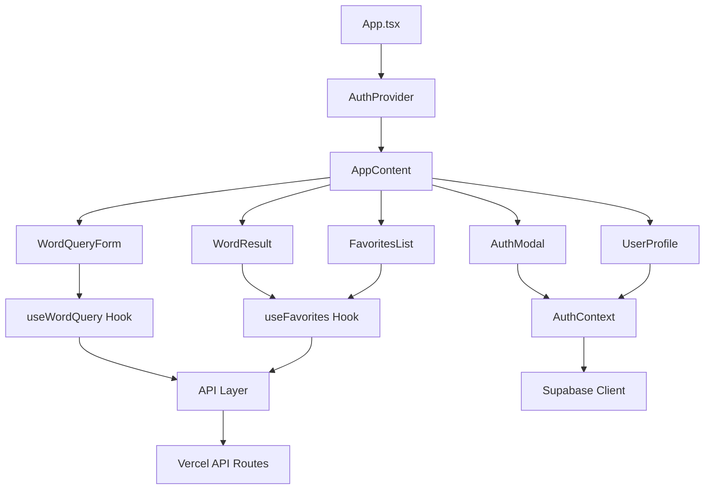

# AI-Voca-2 现有架构深度分析

> **任务来源**: UI-Migration-Analysis.md - 阶段2: AI-Voca-2 融入策略规划  
> **分析目标**: 为oca-2 UI组件融入制定可执行的策略方案

## 📊 **当前项目架构全景图**

### 🏗️ **Monorepo 架构结构**

```
ai-voca-2/
├── packages/
│   ├── frontend/                    # React前端应用 (融入目标)
│   │   ├── src/                     # 源代码目录
│   │   ├── api/                     # Vercel API Routes
│   │   └── package.json             # 前端依赖管理
│   └── shared/                      # 共享类型和工具 (保持不变)
│       ├── src/types/               # TypeScript类型定义
│       └── src/utils/               # 共享工具函数
├── oca-2/                          # 现代UI参考项目
├── package.json                    # 根级依赖管理
└── vercel.json                     # 部署配置
```

---

## 🎯 **Frontend 包架构分析** (融入改造目标)

### 📁 **组件架构关系图**



### 🔧 **现有技术栈分析**

#### **核心依赖清单**
```json
{
  "framework": "React 18.2.0 + TypeScript",
  "bundler": "Vite 4.4.5",
  "styling": "纯CSS文件 (App.css + 各组件.css)",
  "stateManagement": "React Context + Custom Hooks",
  "authentication": "@supabase/supabase-js 2.45.0",
  "httpClient": "axios 1.6.0",
  "deployment": "Vercel (serverless functions)"
}
```

#### **缺失的现代化依赖** (需要集成)
```json
{
  "uiLibrary": "无组件库 → 需要 shadcn/ui",
  "cssFramework": "原生CSS → 需要 Tailwind CSS",
  "formHandling": "原生form → 需要 React Hook Form",
  "iconLibrary": "emoji → 需要 Lucide React",
  "animations": "CSS transition → 需要 tailwindcss-animate"
}
```

---

## 🎨 **现有样式系统分析**

### 📄 **CSS架构现状**
```
src/
├── App.css                        # 全局样式 (264行)
├── index.css                      # 基础重置样式
└── components/
    ├── WordQueryForm.css          # 组件级样式
    ├── WordResult.css
    ├── FavoritesList.css
    └── Auth/
        ├── AuthModal.css
        ├── LoginForm.css
        └── UserProfile.css
```

### 🎭 **现有设计模式特点**
```css
/* 现有样式特征 */
.container {
  max-width: 800px;           /* 固定最大宽度 */
  margin: 0 auto;             /* 居中布局 */
  padding: 20px;              /* 固定内边距 */
}

/* 色彩系统: 传统命名 */
background-color: #f5f5f5;    /* 浅灰背景 */
color: #333;                  /* 深灰文字 */
border: 1px solid #e1e5e9;    /* 边框色 */

/* 响应式: 基础媒体查询 */
@media (max-width: 768px) {
  .container { padding: 15px; }
}
```

### 🔄 **样式系统迁移策略**
```css
/* 现有 → oca-2 映射 */
#333            → hsl(var(--foreground))
#f5f5f5         → hsl(var(--background)) 
#e1e5e9         → hsl(var(--border))
max-width: 800px → container系统
```

---

## ⚙️ **业务逻辑架构分析** (保持不变)

### 🎯 **核心业务Hooks**

#### **useWordQuery Hook** (保持)
```typescript
// 核心功能: 单词查询状态管理
interface UseWordQueryReturn {
  result: WordQueryResponse | null;
  loading: boolean;
  error: string | null;
  queryWord: (word: string) => Promise<void>;
  clearResult: () => void;
  retryQuery: () => Promise<void>;
}

// 业务流程: 
// 1. 发起AI查询 → 2. 获取lemma标准形式 → 3. 检查收藏状态 → 4. 合并显示
```

#### **useFavorites Hook** (保持)
```typescript
// 核心功能: 收藏状态管理
interface UseFavoritesReturn {
  favorites: FavoriteWord[];
  loading: boolean;
  error: string | null;
  toggleFavorite: (word: string, queryData?: WordExplanation) => Promise<boolean>;
  checkFavorite: (word: string) => Promise<{isFavorited: boolean; favoriteData?: WordExplanation}>;
  getFavoritesList: (page?: number, pageSize?: number, search?: string) => Promise<FavoriteListResponse>;
  refreshFavorites: () => Promise<void>;
}
```

#### **AuthContext** (保持)
```typescript
// 认证状态管理 (Supabase集成)
interface AuthContextType {
  user: User | null;
  session: Session | null;
  loading: boolean;
  signIn: (email: string, password: string) => Promise<{error: any}>;
  signUp: (email: string, password: string, displayName?: string) => Promise<{error: any}>;
  signOut: () => Promise<void>;
  resetPassword: (email: string) => Promise<{error: any}>;
}
```

### 📡 **API调用架构** (保持不变)

#### **API Routes结构**
```
packages/frontend/api/
├── health.ts                      # 健康检查
├── words/
│   ├── index.ts                   # API文档
│   └── query.ts                   # 单词查询核心接口
├── favorites/
│   ├── check.ts                   # 检查收藏状态
│   ├── list.ts                    # 获取收藏列表
│   └── toggle.ts                  # 切换收藏状态
└── user/
    └── stats.ts                   # 用户统计信息
```

#### **API客户端架构**
```typescript
// utils/api.ts - HTTP客户端封装
const apiClient = axios.create({
  baseURL: API_BASE_URL,
  timeout: 30000,
  // 自动添加Supabase JWT token
  interceptors: {
    request: async (config) => {
      const session = await supabase.auth.getSession();
      if (session?.access_token) {
        config.headers.Authorization = `Bearer ${session.access_token}`;
      }
      return config;
    }
  }
});
```

---

## 🎯 **UI组件现状与融入映射**

### 📄 **组件替换策略表**

| 现有组件 | 当前实现 | oca-2设计替换 | 保持的业务逻辑 |
|----------|----------|---------------|----------------|
| **App.tsx** | 简单状态管理 + 条件渲染 | AppLayout + SidebarProvider | 页面切换逻辑、认证状态判断 |
| **WordQueryForm** | 原生form + CSS | Enhanced Search Input + Form | useWordQuery Hook调用 |
| **WordResult** | 基础div布局 | Card + Badge + 动画 | 数据展示逻辑、收藏切换 |
| **FavoritesList** | 简单列表 + CSS | Grid布局 + Pagination | useFavorites Hook、搜索过滤 |
| **AuthModal** | 基础Modal + form | Dialog + React Hook Form | AuthContext集成、表单验证 |
| **UserProfile** | 简单用户信息 | DropdownMenu + Avatar | 用户数据显示、登出逻辑 |

### 🏗️ **布局系统升级规划**

#### **现有布局** → **oca-2布局**
```typescript
// 现有: 简单单栏布局
<div className="app">
  <div className="container">
    <header />
    <main>
      {currentPage === 'search' ? <SearchContent /> : <FavoritesContent />}
    </main>
    <footer />
  </div>
</div>

// 升级后: 响应式双栏布局
<SidebarProvider>
  <div className="h-screen bg-gradient-surface flex w-full">
    <AppSidebar className="hidden md:flex" />    // 桌面端侧边栏
    <main className="flex-1 overflow-y-auto">
      <Outlet />                                 // 路由内容区
    </main>
    <BottomNavigation className="md:hidden" />  // 移动端底部导航
  </div>
</SidebarProvider>
```

---

## 📦 **依赖集成评估**

### 🔍 **需要添加的shadcn/ui依赖包**

#### **核心依赖清单**
```json
{
  "shadcn-ui": {
    "@radix-ui/react-*": "各类Radix UI组件",
    "class-variance-authority": "^0.7.0",
    "clsx": "^2.0.0",
    "tailwind-merge": "^2.0.0"
  },
  "tailwindcss": {
    "tailwindcss": "^3.3.0",
    "autoprefixer": "^10.4.16",
    "postcss": "^8.4.31",
    "tailwindcss-animate": "^1.0.7"
  },
  "form-handling": {
    "react-hook-form": "^7.47.0",
    "@hookform/resolvers": "^3.3.1",
    "zod": "^3.22.4"
  },
  "icons-animations": {
    "lucide-react": "^0.292.0",
    "sonner": "^1.2.0"
  }
}
```

#### **兼容性分析**
```typescript
// 现有技术栈兼容检查
✅ React 18.2.0      → shadcn/ui 完全兼容
✅ TypeScript 5.0.2  → 类型定义无冲突  
✅ Vite 4.4.5        → Tailwind插件正常工作
✅ @supabase/*       → 认证系统无影响
✅ axios 1.6.0       → HTTP客户端继续使用
```

### 🎨 **Tailwind CSS集成策略**

#### **配置文件迁移**
```javascript
// 新增: tailwind.config.ts
module.exports = {
  content: ["./src/**/*.{ts,tsx}"],           // 扫描TSX文件
  theme: {
    extend: {
      colors: {
        // 从oca-2移植CSS变量系统
        background: 'hsl(var(--background))',
        foreground: 'hsl(var(--foreground))',
        primary: 'hsl(var(--primary))',
        // ... 完整色彩系统
      }
    }
  },
  plugins: [require("tailwindcss-animate")]
}
```

#### **CSS变量迁移映射表**
```css
/* 新增: src/index.css - 设计系统变量 */
:root {
  /* 从oca-2移植 */
  --background: 240 10% 98%;           /* 替换 #f5f5f5 */
  --foreground: 240 10% 15%;           /* 替换 #333 */
  --border: 240 6% 90%;                /* 替换 #e1e5e9 */
  --primary: 248 95% 62%;              /* 新增主品牌色 */
  --muted: 240 5% 94%;                /* 新增静音背景 */
  
  /* 现有样式向后兼容 */
  --container-max-width: 800px;        /* 保持现有布局约束 */
}
```

---

## 🚫 **明确的不可变更清单**

### 🔒 **架构层面 (绝对不变)**
```
✅ packages/ monorepo结构              → 保持完整的包结构
✅ packages/shared/ 共享类型和工具      → 完全复用TypeScript接口
✅ vercel.json 部署配置                → 保持现有部署流程  
✅ 根目录package.json 依赖管理         → 工作区配置不变
✅ .env 环境变量配置                   → Supabase连接信息不变
```

### 🔒 **业务逻辑层 (绝对不变)**
```
✅ packages/frontend/api/ 所有API Routes    → Vercel Functions保持不变
✅ src/hooks/ 所有自定义Hook                → 业务逻辑完全保留
✅ src/contexts/AuthContext.tsx            → Supabase认证集成不变
✅ src/utils/api.ts HTTP客户端             → 请求拦截器和axios配置保持
✅ src/lib/supabase.ts 数据库连接          → 客户端配置不变
```

### 🔒 **数据层面 (绝对不变)**
```
✅ WordQueryRequest/WordQueryResponse类型   → API接口契约不变
✅ FavoriteWord/WordExplanation数据结构     → 数据模型完全保留
✅ Supabase数据库Schema                    → 表结构和关系不变
✅ 用户认证和会话管理                       → JWT token机制保持
```

---

## 🔄 **仅UI层变更清单**

### 🎨 **样式系统变更 (可控范围)**
```
🔄 src/App.css → 逐步迁移到Tailwind classes
🔄 src/index.css → 集成oca-2设计系统CSS变量
🔄 components/*.css → 用shadcn/ui组件替换
🔄 新增 tailwind.config.ts → Tailwind配置
🔄 新增 components.json → shadcn/ui配置
```

### 🧩 **组件层变更 (UI only)**
```
🔄 src/App.tsx → 集成AppLayout + SidebarProvider (保持状态逻辑)
🔄 src/components/*.tsx → 使用shadcn/ui重构UI (保持props接口)  
🔄 新增 src/components/ui/ → shadcn/ui组件库
🔄 新增 src/lib/utils.ts → cn工具函数
```

---

## 📋 **阶段2任务完成确认**

### ✅ **完成标准达成**

#### **1. 创建当前组件关系图**
- [x] **组件架构**: App → AuthProvider → AppContent → 各功能组件的层次关系
- [x] **数据流向**: Hooks → API Layer → Vercel Routes的完整链路  
- [x] **状态管理**: Context + Custom Hooks的依赖关系图

#### **2. 绘制数据流图，标明API调用点和状态更新路径**
- [x] **API调用点**: useWordQuery、useFavorites → utils/api.ts → Vercel API Routes
- [x] **状态更新**: Hook内部状态 → Context状态 → 组件UI状态的更新路径
- [x] **认证流程**: AuthContext → Supabase → API拦截器的认证链路

#### **3. 文档化所有Context和自定义Hook的职责和接口**
- [x] **AuthContext**: 完整的认证状态管理接口定义
- [x] **useWordQuery**: 单词查询的状态和方法接口
- [x] **useFavorites**: 收藏管理的完整功能接口

#### **4. 列出明确的"不可变更"清单，包含文件路径和原因**
- [x] **架构层**: packages结构、vercel配置、环境变量
- [x] **业务逻辑层**: API Routes、Hooks、Context、数据模型
- [x] **数据层**: TypeScript接口、Supabase Schema、认证机制

**下一步**: 继续执行阶段2第二个任务 - shadcn/ui依赖评估和兼容性分析 