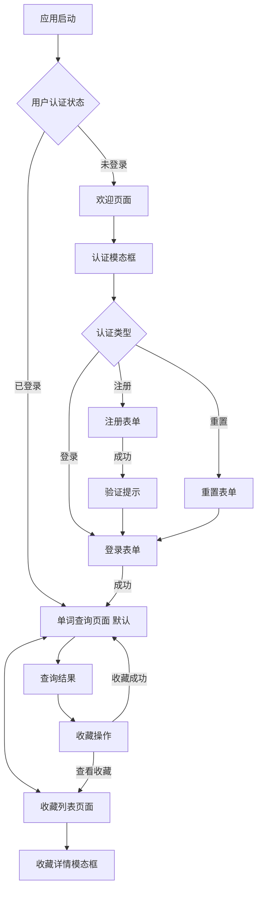

## 项目背景：
这是一个云原生部署的 React + TypeScript + Vite 应用，需要重新设计 UI/UX。

## 技术栈要求：

React + TypeScript + Vite
支持 API Routes
云原生部署友好


## 设计要求：

现代、美观的 UI 设计
优秀的用户体验
响应式布局
性能优化
代码结构清晰，便于迁移
交付物：

## 完整的前端代码仓库
组件库文档
设计系统说明（颜色、字体、间距等）
部署说明

## 需求文档

### 1.1 应用名称和核心价值主张
**AI-Voca-2** - 基于人工智能的智能词汇学习助手

**核心价值主张**:
- 🤖 **AI驱动智能解释**: 采用Gemini 2.5模型提供深度、个性化的单词解释
- 🧠 **词形还原技术**: 智能识别单词变形，提供标准形式和变形说明  
- ⭐ **个性化收藏系统**: 用户可收藏单词，建立个人词汇库
- 🌐 **云原生架构**: 无服务器架构，零运维，全球加速访问
- 🎯 **学习者友好**: 专注中文用户英语学习需求，提供结构化学习内容

### 1.2 目标用户群体

#### 主要用户群体
1. **英语学习者** (75%)
   - 年龄段: 16-35岁
   - 学习阶段: 高中至大学、职场人士
   - 需求: 快速理解生词，积累词汇量

2. **专业译员和英语教师** (15%)
   - 需求: 准确的词汇解释和例句
   - 使用场景: 备课、翻译工作参考

3. **英语爱好者和自学者** (10%)
   - 特点: 对英语有浓厚兴趣
   - 需求: 深度理解词汇文化背景和使用场景

#### 用户画像
- **地理分布**: 主要为中文用户（中国大陆、台湾、香港、海外华人）
- **设备使用**: 70%移动端，30%桌面端
- **使用习惯**: 碎片化学习，注重效率和准确性

### 1.3 主要使用场景

#### 场景1: 阅读中查词 (40%)
- **触发条件**: 阅读英文材料遇到生词
- **用户行为**: 快速输入单词获取解释
- **期望结果**: 获得准确中文释义和使用例句
- **典型设备**: 手机、平板电脑

#### 场景2: 词汇学习和复习 (35%)
- **触发条件**: 主动学习新词汇
- **用户行为**: 查询单词并加入收藏，后续复习
- **期望结果**: 深入理解词汇含义、用法和记忆技巧
- **典型设备**: 电脑、手机


---

## 2. 功能清单

### 2.1 核心功能模块

#### 🔐 用户认证模块
**功能描述**: 基于Supabase Auth的完整用户管理系统
- **用户注册**: 邮箱注册，支持昵称设置
- **用户登录**: 邮箱密码登录，JWT token管理
- **密码重置**: 邮箱验证的密码重置流程
- **用户资料**: 显示用户信息、查询统计、头像生成
- **会话管理**: 自动登录状态维持和安全登出

**用户交互流程**:
```
访问应用 → 点击"登录/注册" → 选择登录/注册表单 → 
输入凭据 → 后端验证 → JWT token生成 → 自动登录成功
```

**数据流向**: 
`前端表单` → `Supabase Auth API` → `JWT Token` → `认证状态更新` → `用户界面刷新`

#### 🔍 单词查询模块  
**功能描述**: AI驱动的智能单词解释系统
- **输入验证**: 支持字母、数字、连字符、撇号，最大100字符
- **AI查询**: 调用AiHubMix Gemini模型生成专业解释
- **词形还原**: 智能识别并解释单词变形（如running→run）
- **XML解析**: 解析AI返回的结构化XML响应
- **查询记录**: 自动保存查询历史到数据库
- **智能重试**: 基于嵌入参数的一键重试功能

**用户交互流程**:
```
输入单词 → 提交查询 → 显示加载状态 → AI处理响应 → 
XML解析转换 → 查询结果展示 → 用户可进行收藏操作
```

**数据流向**:
`查询表单` → `API认证验证` → `AiHubMix AI服务` → `XML响应解析` → `数据库记录保存` → `前端结果展示`

#### ⭐ 收藏管理模块
**功能描述**: 个性化单词收藏和管理系统  
- **收藏切换**: 一键添加/删除收藏，实时状态同步
- **收藏检查**: 智能检测当前单词收藏状态
- **分页列表**: 支持分页加载，每页20个收藏项
- **搜索过滤**: 支持关键词搜索收藏的单词
- **详情查看**: 模态弹窗展示完整单词解释
- **批量管理**: 支持删除单个收藏项

**用户交互流程**:
```
查看单词结果 → 点击收藏按钮 → 收藏状态切换 → 
前往收藏列表 → 浏览/搜索收藏 → 查看详情/删除操作
```

**数据流向**:
`收藏操作` → `API认证` → `数据库收藏表操作` → `本地状态同步` → `UI状态更新`

#### 📊 数据管理模块
**功能描述**: 用户学习数据的存储和展示
- **查询历史**: 记录所有查询请求和结果
- **用户统计**: 展示查询次数和使用情况
- **数据同步**: 跨设备数据同步和备份
- **行级安全**: RLS保护用户数据隐私

### 2.2 API Routes 清单

#### 系统监控 API
| 端点 | 方法 | 认证 | 参数 | 返回值 |
|------|------|------|------|--------|
| `/api/health` | GET | 否 | 无 | 系统健康状态 |

**业务逻辑**: 检查环境变量配置和系统运行状态

#### 单词查询 API  
| 端点 | 方法 | 认证 | 参数 | 返回值 |
|------|------|------|------|--------|
| `/api/words/query` | GET/POST | 是 | `{word: string, includeExample?: boolean}` | `WordQueryResponse` |
| `/api/words` | GET | 否 | 无 | API使用说明 |

**业务逻辑**: JWT验证 → 参数验证 → AI查询 → XML解析 → 数据库记录 → 响应返回

#### 用户统计 API
| 端点 | 方法 | 认证 | 参数 | 返回值 |
|------|------|------|------|--------|  
| `/api/user/stats` | GET | 是 | 无 | 用户查询统计 |

**业务逻辑**: 从数据库聚合用户查询数据并返回统计信息

#### 收藏功能 API群
| 端点 | 方法 | 认证 | 参数 | 返回值 |
|------|------|------|------|--------|
| `/api/favorites/check` | GET | 是 | `word` | 收藏状态检查 |
| `/api/favorites/list` | GET | 是 | `page, pageSize, search` | 分页收藏列表 |
| `/api/favorites/toggle` | POST | 是 | `FavoriteToggleRequest` | 收藏操作结果 |

**业务逻辑**: 
- **检查**: 查询数据库中用户对特定单词的收藏状态
- **列表**: 分页查询用户收藏，支持搜索过滤和排序
- **切换**: 根据当前状态添加或删除收藏记录

---

## 3. 页面结构

### 3.1 所有页面/路由列表

由于采用**状态驱动的SPA架构**，应用通过组件状态控制页面显示：

#### 主要页面状态
```typescript
type PageType = 'search' | 'favorites'
type AuthModalState = 'login' | 'signup' | 'reset' | null
```

#### 页面清单
1. **欢迎页面** - 未登录用户看到的引导页面
2. **单词查询页面** - 主要功能页面，包含查询表单和结果展示
3. **收藏列表页面** - 用户收藏的单词管理页面  
4. **认证模态框** - 登录、注册、密码重置的模态窗口

### 3.2 页面间的导航关系



#### 导航触发方式
- **主导航**: 头部标签页切换 (`单词查询` ↔ `我的收藏`)
- **功能导航**: 查询结果的收藏按钮、收藏列表的查看详情
- **模态导航**: 认证表单内部状态切换

### 3.3 每个页面包含的功能组件

#### 3.3.1 欢迎页面 (未登录状态)
**页面布局**:
```
Header (简化版)
├── 品牌Logo和标语
└── 登录按钮

Main Content
├── 应用介绍和特点
├── 功能预览
└── 引导注册/登录

Footer
└── 版权信息
```

**功能组件**: 无交互组件，纯展示页面

#### 3.3.2 单词查询页面
**页面布局**:
```  
Header (完整版)
├── 品牌标题
├── 用户下拉菜单 (UserProfile)
└── 主导航标签

Main Content  
├── WordQueryForm (查询表单)
│   ├── 单词输入框
│   ├── 查询/清空按钮
│   └── 输入验证提示
└── WordResult (结果展示) [条件渲染]
    ├── 单词标题区 (含收藏按钮)
    ├── 基础信息 (音标、词性、释义)
    ├── 例句列表
    ├── 词汇扩展 (同义词、反义词)  
    ├── 学习辅助 (词源、记忆技巧)
    └── 功能操作 (重试、复制、原始数据)
```

**交互组件**:
- **WordQueryForm**: 输入验证、提交处理、状态管理
- **WordResult**: 收藏切换、重试查询、内容复制、详情展开
- **UserProfile**: 用户菜单、统计信息、登出操作

#### 3.3.3 收藏列表页面  
**页面布局**:
```
Header (完整版)
└── [同单词查询页面]

Main Content
├── 收藏统计 (总数量、搜索状态)
├── 搜索过滤框
├── FavoritesList (收藏网格)
│   ├── 收藏卡片 * N (响应式网格)
│   │   ├── 单词标题
│   │   ├── 释义摘要  
│   │   ├── 收藏日期
│   │   └── 操作按钮 (查看详情、删除)
│   └── 分页导航
└── FavoriteDetailModal (详情模态框) [条件渲染]
    └── [完整的WordResult组件复用]
```

**交互组件**:
- **FavoritesList**: 分页加载、搜索过滤、卡片操作
- **搜索框**: 实时搜索、搜索状态管理
- **FavoriteDetailModal**: 模态框控制、详情展示、删除确认

#### 3.3.4 认证模态框
**组件结构**:
```
AuthModal (模态框容器)
├── 模态框遮罩和关闭控制
└── 表单内容区
    ├── LoginForm [条件渲染]
    │   ├── 邮箱/密码输入
    │   ├── 登录按钮  
    │   ├── 密码重置链接
    │   └── 注册切换链接
    ├── SignupForm [条件渲染]  
    │   ├── 邮箱/密码/昵称输入
    │   ├── 密码确认
    │   ├── 注册按钮
    │   └── 登录切换链接
    └── 重置密码表单 [条件渲染]
        ├── 邮箱输入
        ├── 发送重置邮件按钮
        └── 返回登录链接
```

**状态管理**: 内部状态控制表单切换、加载状态、错误处理

---

## 4. 数据模型

### 4.1 主要的数据结构定义 (TypeScript Interfaces/Types)

#### 核心业务实体

**WordExplanation** - 单词解释核心数据模型
```typescript
export interface WordExplanation {
  word: string;                        // 原始查询单词
  text?: string;                       // lemma后的标准单词形式
  lemmatizationExplanation?: string;   // 词形还原说明
  pronunciation?: string;              // 音标
  partOfSpeech?: string;              // 词性
  definition: string;                 // 中文释义 (必需字段)
  simpleExplanation?: string;         // 英文简单解释
  examples?: WordExample[];           // 例句数组
  synonyms?: string[];                // 同义词
  antonyms?: string[];                // 反义词
  etymology?: string;                 // 词源信息
  memoryTips?: string;                // 记忆技巧
}
```

**FavoriteWord** - 收藏单词实体
```typescript
export interface FavoriteWord {
  id: string;                      // UUID主键
  word: string;                    // 标准化单词
  originalQuery?: string;          // 原始查询词
  queryData: WordExplanation;      // 完整单词数据
  notes?: string;                  // 用户笔记
  createdAt: string;              // 创建时间
  updatedAt: string;              // 更新时间
}
```

#### API请求响应模型

**WordQueryRequest** - 查询请求
```typescript
export interface WordQueryRequest {
  word: string;              // 查询单词 (必需)
  includeExample?: boolean;  // 包含例句 (默认true)
}
```

**WordQueryResponse** - 查询响应
```typescript  
export interface WordQueryResponse {
  success: boolean;                   // 操作成功标志
  data?: WordExplanation;            // 单词数据
  error?: string;                    // 错误信息
  timestamp: number;                 // 响应时间戳
  rawResponse?: string;              // AI原始响应(调试)
  inputParams?: {                    // 重试参数
    word: string;
    timestamp: number;
  };
  isFavorited?: boolean;            // 收藏状态
}
```

**FavoriteListResponse** - 收藏列表响应
```typescript
export interface FavoriteListResponse {
  success: boolean;
  data: {
    favorites: FavoriteWord[];        // 收藏列表
    pagination: {
      total: number;                  // 总数量
      page: number;                   // 当前页
      pageSize: number;               // 每页大小
      totalPages: number;             // 总页数
    };
  };
  error?: string;
}
```

#### 认证和用户模型

**AuthUser** - 认证用户
```typescript
interface AuthUser {
  id: string;              // 用户UUID
  email: string;           // 用户邮箱
  user_metadata: {         // 用户元数据
    display_name?: string;
    avatar_url?: string;
  };
}
```

**UserProfile** - 用户资料
```typescript
interface UserProfile {
  id: string;                    // 用户ID
  display_name?: string;         // 显示名称
  avatar_url?: string;          // 头像URL
  subscription_tier: string;     // 订阅层级
  created_at: string;           // 创建时间
  updated_at: string;           // 更新时间
}
```

### 4.2 状态管理方案

#### React Context + Custom Hooks 架构

**AuthContext** - 全局认证状态
```typescript
interface AuthContextType {
  // 状态
  user: User | null;                    // Supabase用户对象
  session: Session | null;              // 用户会话
  loading: boolean;                     // 认证加载状态
  
  // 操作方法
  signIn: (email: string, password: string) => Promise<AuthResponse>;
  signUp: (email: string, password: string, displayName?: string) => Promise<AuthResponse>;
  signOut: () => Promise<void>;
  resetPassword: (email: string) => Promise<AuthResponse>;
}
```

**useWordQuery Hook** - 查询状态管理
```typescript
interface UseWordQueryReturn {
  // 状态
  result: WordQueryResponse | null;      // 查询结果
  loading: boolean;                      // 查询加载状态
  error: string | null;                  // 错误信息
  
  // 操作方法  
  queryWord: (word: string) => Promise<void>;       // 执行查询
  clearResult: () => void;                          // 清空结果
  retryQuery: () => Promise<void>;                  // 重试查询
}
```

**useFavorites Hook** - 收藏状态管理
```typescript
interface UseFavoritesReturn {
  // 状态
  favorites: FavoriteWord[];             // 收藏列表
  loading: boolean;                      // 操作加载状态
  error: string | null;                  // 错误信息
  
  // 操作方法
  toggleFavorite: (word: string, originalQuery?: string, queryData?: WordExplanation) => Promise<boolean>;
  checkFavorite: (word: string) => Promise<{isFavorited: boolean; favoriteData?: WordExplanation}>;
  getFavoritesList: (page?: number, pageSize?: number, search?: string) => Promise<FavoriteListResponse>;
  refreshFavorites: () => Promise<void>;
  clearError: () => void;
}
```


---

## 5. 技术约束

### 5.1 必须保持的技术栈

#### 前端技术栈 (不可更改)
- **React 18**: 使用最新React特性，包括Hooks、Concurrent Features
- **TypeScript**: 严格类型检查，提供完整的类型安全
- **Vite**: 构建工具，支持热更新和快速构建

#### 云服务技术栈 (已集成)
- **Vercel**: 无服务器部署平台，API Routes后端
- **Supabase**: PostgreSQL数据库 + 用户认证系统
- **AiHubMix**: AI服务提供商，使用Gemini 2.5模型

#### 可选技术栈 (可以增强)
```json
{
  "UI框架": "可考虑集成Ant Design, Material-UI等",
  "路由": "建议引入React Router替代状态路由",
  "状态管理": "当前使用Context+Hooks，可升级至Zustand/Redux Toolkit",
  "样式方案": "可引入Styled-components, Emotion或Tailwind CSS",
  "测试框架": "建议添加Jest + React Testing Library"
}
```


---

## 6. 现有 UI/UX 痛点 & 希望改进点

### 6.1 现有设计优点 (保留)

#### ✅ 信息架构清晰
- **逻辑流程**: 登录→查询→收藏的用户路径非常直观
- **功能分区**: 查询和收藏功能分离清晰，不会互相干扰
- **状态反馈**: 加载、成功、错误状态都有明确的视觉反馈

#### ✅ 内容优先设计  
- **结构化展示**: 单词解释按层次结构组织，便于阅读理解
- **关键信息突出**: 中文释义和例句作为最重要内容突出显示
- **功能操作便捷**: 收藏、重试等操作按钮位置合理

#### ✅ 响应式基础良好
- **多设备适配**: 基本的桌面端和移动端适配完成
- **触摸友好**: 按钮尺寸符合移动端点击标准
- **布局弹性**: 使用Flexbox和Grid实现弹性布局

### 6.2 关键痛点和改进机会

#### 🔄 **P1 - 导航和路由系统 (高优先级)**

**现状问题**:
- 使用组件状态控制页面显示，无真实URL路由
- 不支持浏览器前进/后退操作
- 无法通过URL直接访问特定页面
- 不支持书签保存和分享

**用户影响**:
- 用户无法分享特定查询结果
- 浏览器后退按钮无效，用户体验不符合Web标准
- 无法通过收藏夹直接访问功能页面

**改进建议**:
```javascript
// 引入React Router实现真实路由
const routes = [
  { path: '/', component: HomePage },
  { path: '/search', component: WordSearchPage },
  { path: '/search/:word', component: WordResultPage },  // 支持直接访问查询结果
  { path: '/favorites', component: FavoritesPage },
  { path: '/profile', component: UserProfilePage }
]
```

**预期效果**:
- 支持深度链接和页面分享
- 符合用户对Web应用的操作习惯
- 改善SEO和可访问性

#### 📱 **P1 - 移动端体验优化 (高优先级)**

**现状问题**:
- 移动端布局基本但不够精致
- 缺乏原生移动端交互手势
- 输入法适配和虚拟键盘处理不完善

**具体痛点**:
- 长列表滚动体验不够流畅
- 模态框在小屏幕设备上占屏比例不合适


